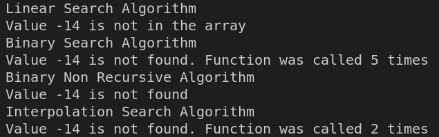

# Searching algorithms 

## Linear searching
Linear search algorithm is the simplest one. Sequentially read each element one by one on a given array until the desired element is found. This method may be not effective for arrays with large numbers of items.

## Binary searching
Binary search needs a sorted array to start the process. So, if the elements are not sorted, the array must be sorted for the implementation. This algorithm can be implemented with an iterative method or a recursive method.
This method searches the middle element of an array and it compares this value with the value being searched. If the searched value is in the middle, then this position is returned. Else, if the searched value is greater than the middle one, the process is made within the upper half. Otherwise, the lower half is used. This process is made until the searched element is found. 

## Interpolation searching  
This algorithm is an improvement of the Binary search. The array must be sorted and equally distributed first. The interpolation search starts the searching from the element closest to the one that it's been searched for. For large numbers the process will start towards the end of the array and for smaller numbers will start from the beginning. It uses a formula derived from the equation of a straight line.

$$
index=Lo+\frac{(Hi - Lo)}{A[Hi]-A[Lo]} * (X-A[Lo])
$$
Where:\
A = array\
Hi = Highest index of the array\
Lo = Lowest index of the array\
X = searched element\

The element at the calculated index is compared with X. If the value is less than X, the process is repeated with the right half of the array.

If the value is greater than X, the next index is calculated with the left half of the array.

If the value at the index is equal to X, the element X in the array is found and the process is completed.
## Interpolation, Binary and Linear Search Comparison

Linear Search is the simple algorithm but for large items arrays it will take long to complete the execution because it compares each element of the array until the desired element is found. 

The main difference between interpolation and binary search is where the process starts. Binary starts always in the middle of the array, while interpolation starts searching for the wanted element using an equation which starts where the element is most likely present. Interpolation works better if the array is uniformly distributed because the equation used is first represented by a straight line.

In the example a sorted and equally distributed array is used:

The results of the searching process gave this results:

Recursive implementation of Interpolation Searching is called fewer times than the Binary implementation. So it shows a better performance because of the method used to start the searching process. 
