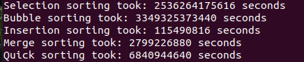

# Algorithms 

## Bubble Sorting
For each element of the array, a comparison between adjacents elements is made. If the second element of the array is smaller than the first element,  they swap their position. Then the third element is compared with the second and this process continues until the array final element. An the iteration continues until the array is sorted.

## Selection Sorting
It sets the first element of the array as the minimum. This value is compared with the next element of the unsorted array. If the next element is smallest, it is assigned as mininum. This process is applied to the rest items of the array.    

## Insertion Sorting
This algorithm splits the array in two, sorted and unsorted. It sets the second element as a key element. If the first element of the array is greater than the key, then key is placed in front of this element which is the sorted part of the array. Then the iteration continues within the unsorted part of the array until the final element is sorted.

    

## Merge Sort

The merge sort algorithm divides the array in two equals parts repeatedly until it reaches 1-element array and then merges then comparing right size and the left size of the divided array and combines them into a sorted array.

## Quick Sort

This algorithm uses a pivot element, it can be the last, first or a random element. First step: the array is divided into two subarrays where elements smaller than pivot are position to the right and elements greater than pivot are position to the left. Then pivot element is placed on its correct position.  This process is then repited for the two subarrays and recursevely repited until the array is sorted. 

# Performance

  *Insertion* algorithm has better performace for the case of smaller arrays because it uses an average far fewer operations per single exchange. It splits the array and works on the unsorted part of it. *Merge* and *Quick* sorting are based on divide and conquer approach with slight differences. They both have good performances due of the use of array partition and are more effective with a couple of million items array. *Bubble* algorithm is the worst it terms of performace because all the comparisons are made even if the array is already sorted. This increases the use of computer memory (RAM) as the array elements increase. 

## Example with 100000 element array:  

  **Best choice**: *Insertion* algorithm for its performance in small arrays and *Quick* and *Merge* when million items array are used.